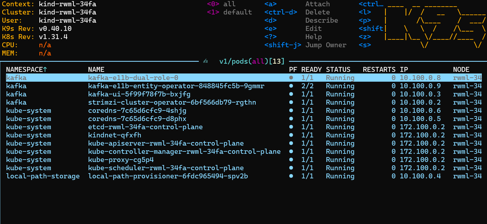
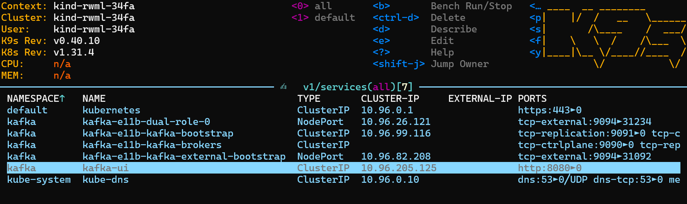
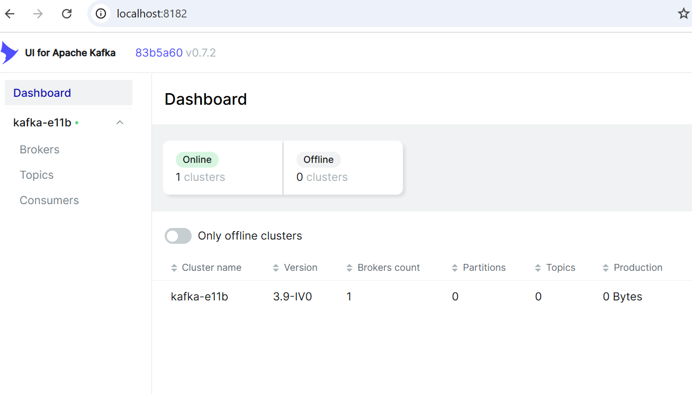
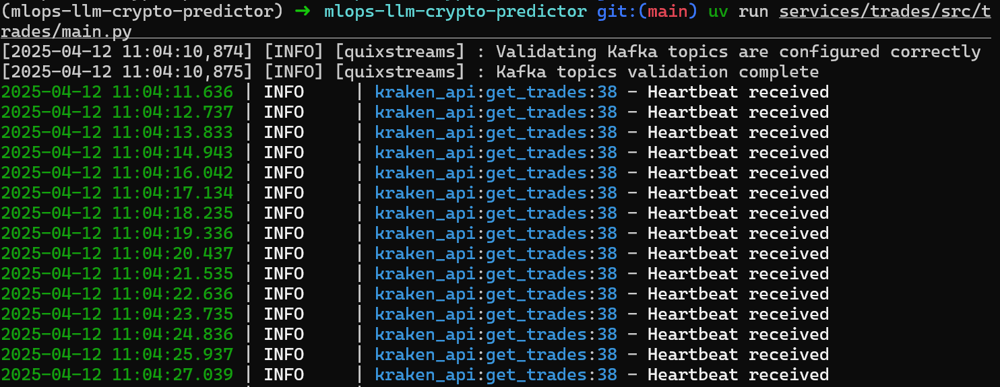
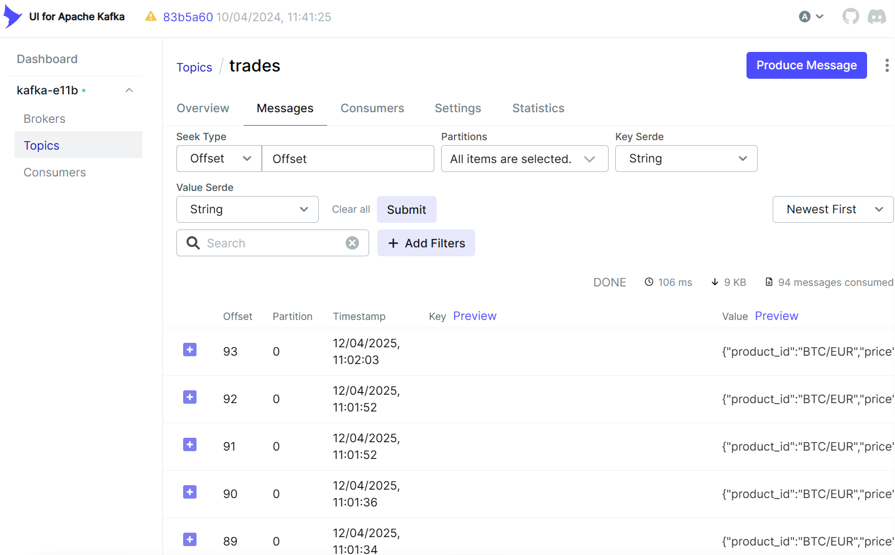
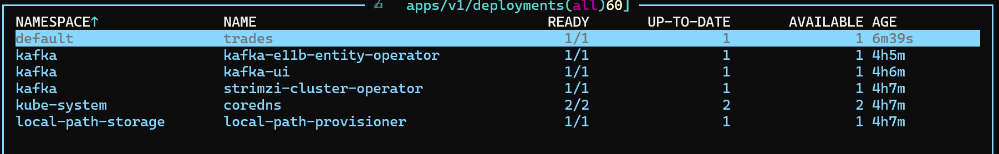

# mlops-llm-crypto-predictor

## Initialize the Project

Initialize the project from the root directory. This will create the main `pyproject.toml` file.

```bash
uv init
```

Create a `trades` workspace in the `services` directory. This will create a `pyproject.toml` file in the `trades` workspace, with the `src` layout, and incllude the `hatchling` build-system. Additionally, it will add the `trades` workspace to the main `pyproject.toml` file.

```bash
cd services
uv init --lib trades
```

### Adding Workspaces

Each service is treated as a separate workspace. The `uv` tool uses the `[tool.uv.workspace]` section to define all workspace members.

To declare a workspace member in the main `pyproject.toml`:

```toml
[tool.uv.workspace]
members = ["services/trades"]
```

To add a workspace as a dependency, use:

```bash
uv add trades
```

This command does two things:

1. Adds trades to the dependencies list.

1. Adds an entry to the [tool.uv.sources] section in `pyproject.toml`, marking it as a workspace dependency:

   ```toml
   [tool.uv.sources]
   trades = { workspace = true }
   ```

### Adding Dependencies

To add dependencies to the main project, use the following command:

```bash
uv add quixstreams
```

To add local dependencies for development (`dependency-groups`) use the following command:

```bash
uv add --group tests pytest
```

### Synchronize the Project

To synchronize the project without installing the dependency groups, use the following command:

```bash
uv sync
```

To synchronize the project and install the dependency groups, use the following command:

```bash
uv sync --all-groups
```

## Setting up Kafka

To setup Kafka, we need first to create a Kind cluster with port mapping.

There are several scripts and folders in the `deployments/dev/kind` directory.

- `kind-with-portmapping.yaml`: This is the Kind configuration file. It includes the port mapping for Kafka.
- `manifests`: This folder contains the Kafka configuration files.
  - `kafka-e11b.yaml`: This is the Kafka configuration file. It includes the port mapping for Kafka.
  - `kafka-ui-all-in-one.yaml`: This is the Kafka UI configuration file. It includes the port mapping for Kafka UI.
- `install_kafka.sh`: This script installs Kafka using [Strimzi](https://strimzi.io/quickstarts/) that allows to use Kafka in Kubernetes. It uses the `kafka-e11b.yaml` configuration file.
- `install_kafka_ui.sh`: This script installs Kafka UI to make it easier to manage Kafka in a Web UI. It uses the `kafka-ui-all-in-one.yaml` configuration file.
- `create_cluster.sh`: This script runs all the previous scripts in order to create the Kind cluster with Kafka and Kafka UI.

Once you run the `create_cluster.sh` script (with docker running), you should see the following output in the `k9s` terminal:

```bash
chmod +x create_cluster.sh
./create_cluster.sh
```



If we type `svc` in the `k9s` terminal, we should see the following output and the port mapping for Kafka and Kafka UI `8080`:



To visualize the Kafka UI, it is necessary to forward the port `8080` from the `kafka-ui` service (which communicates internally with the Kafka cluster on port `9092`) to port `8182` (or any other free port) on your local machine. This means that any traffic sent to `http://localhost:8182` on your local machine will be forwarded to the `kafka-ui` service running inside the Kubernetes cluster on port `8080`.

```bash
kubectl -n kafka port-forward svc/kafka-ui 8182:8080
```

Now you can access the Kafka UI in your local machine at `http://localhost:8182` or `http://127.0.0.1:8182`.



You can test the connection to the Kafka broker on TCP port `31234` with the following command:

```bash
nc -vvv localhost 31234
```

### Running a Service

Once you have the Kafka cluster running, you can run the services.

The first service is the `trades` service. This service will connect to the Kraken API and get the trades data in real time. It will then produce the trades data to the Kafka topic `trades`.

The following command will run the `trades` service, and you should see the trades data in the Kafka UI together with the terminal output:

```bash
uv run services/trades/src/trades/main.py
```





### Using the Makefile

The project includes a Makefile with several useful commands for development and deployment:

#### Kind Cluster Management

```bash
make start-kind-cluster  # Start the Kind cluster with port mapping (or build it if it doesn't exist)
make stop-kind-cluster   # Stop the Kind cluster
```

#### Development Commands

```bash
make dev service=trades             # Run a specific service in development mode
make build-for-dev service=trades   # Build a service's Docker image for development
make push-for-dev service=trades    # Push a service's Docker image to the Kind cluster
make deploy-for-dev service=trades  # Deploy a service to the Kind cluster
```

To verify the deployment, use the following command or use `k9s` terminal:

```bash
kubectl get deployments --all-namespaces
```




#### Linting and Formatting

```bash
make ruff    # Run Ruff linter with auto-fix
make mypy    # Run MyPy static type checker
make clean   # Clean up cached files and build artifacts
make all     # Run all linting and formatting commands
```

#### Help Command

```bash
make help    # Display all available make commands with descriptions
```
